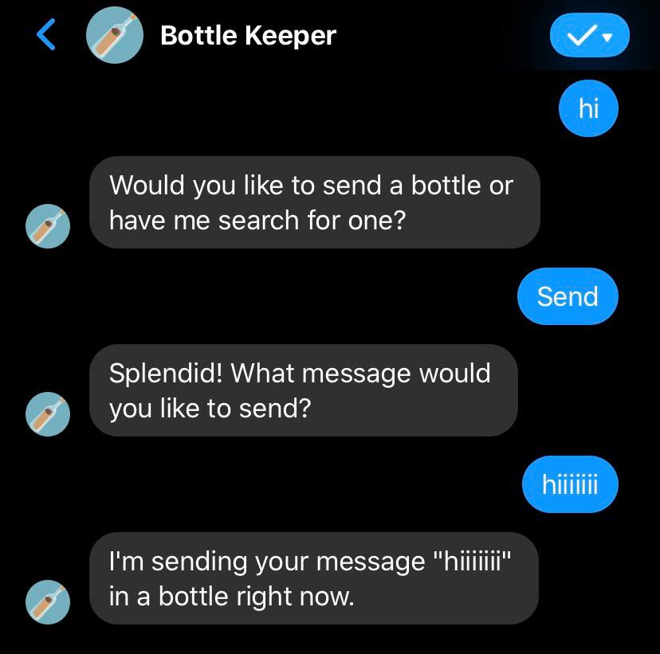
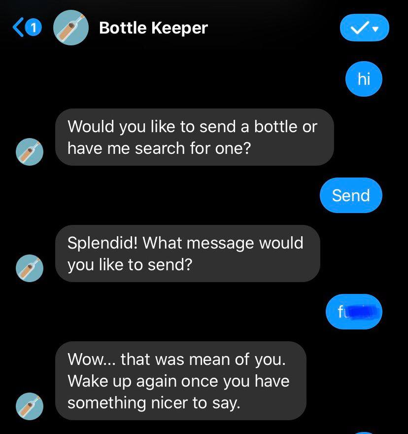
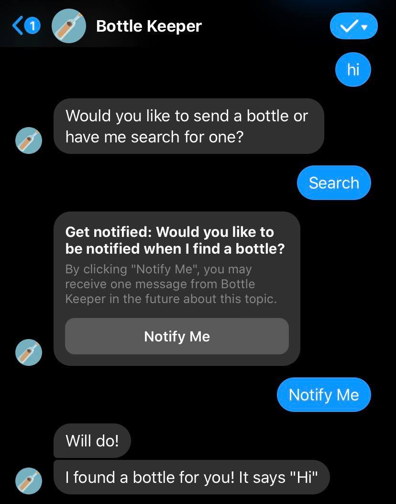



Peerdea
======
Peerdea is a mobile application for both iOS and Android, currently deployed onto TestFlight and pending deployment on the Play Store. 

Here is a brief demonstration video of Peerdea's flow:

Made with:
* React Native & Javascript 
* MongoDB 
* Expo 
* Docker 
* Microsoft Azure 

Bottle Keeper
======
In light of COVID-19, many are feeling more isolated from others or are experiencing increased loneliness due to social distancing. In my collaboration with Jun Kim, we sought to create a solution that will allow Facebook users to harbor a sense of connection with others in a fun and interactive way. 

Bottle Keeper is a Facebook Messenger chatbot that allows the user to experience a virtual "message-in-a-bottle" interactions with other anonymous users. You are able to message Bottle Keeper [here](https://www.facebook.com/Bottle-Keeper-110293290724548) and send anonymous messages, known as bottles, or choose to be notified when Bottle Keeper finds one that another has sent. It is also capable of filtering out vulgar and explicit messages to keep bottles friendly and positive.  

You can see sample interactions between a user and Bottle Keeper below: 

{width=30% height=30%} 
{width=30% height=30%} 
{width=30% height=30%} 

Made with:
* Javascript 
* Heroku 
* MongoDB 

Flashcard Tutor
======
description and images

Made with:
* Python 

Restaurant Website (Chick-fil-b)
======
description and images
Made with:
* HTML & CSS & Javascript
* Django 
* Microsoft Azure 
